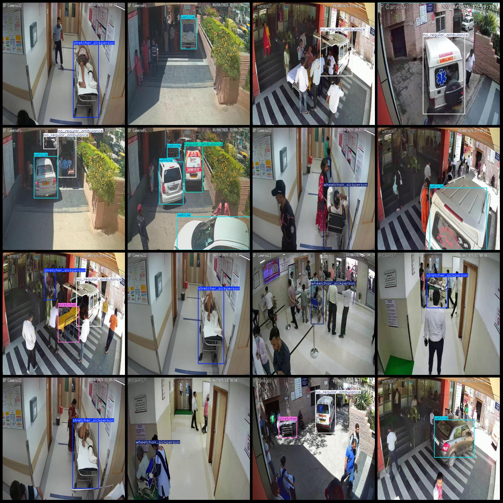
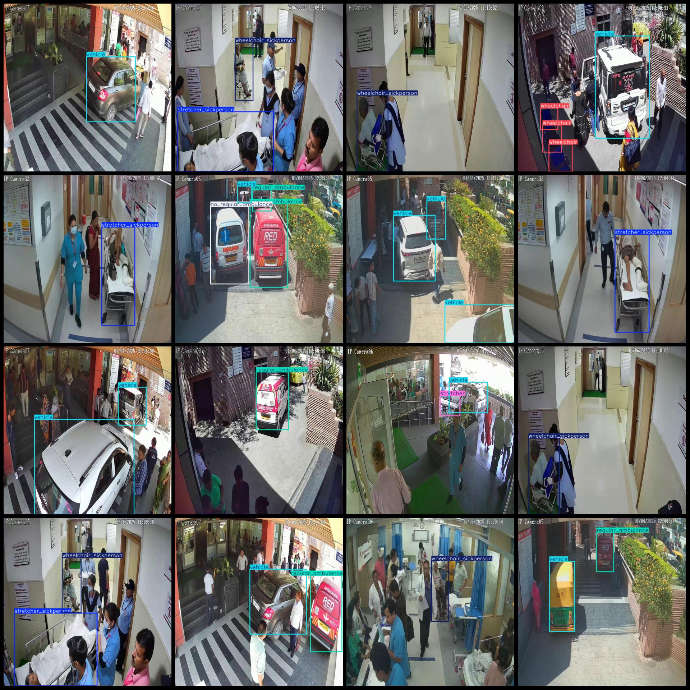

# Hospital Ambulance Stretcher Wheelchair Detection Data Set - VOC+YOLO Format

Dataset structure: Pascal VOC format + YOLO format (txt files without split paths, only containing jpg images and corresponding VOC format xml files and yolo format txt files)
Number of images (jpg file count): 8187
Number of annotations (xml file count): 8187
Number of annotations (txt file count): 8187
Number of categories: 8
Category names in the annotation file (note that the order in the yolo format does not correspond to this, and the correct order is as per the labels folder 'classes.txt'): ["no_regular_ambulance", 
"regular_ambulance", "sickperson", "stretcher", "stretcher_sickperson", "vehicle", "wheelchair", "wheelchair_sickperson"]
Box counts for each category:
- No regular ambulance (non-standard ambulance) boxes = 1301, occupied images = 1196
- Regular ambulance (standard ambulance) boxes = 1934, occupied images = 1810
- Sickperson (patient) boxes = 75, occupied images = 74
- Stretcher (hospital stretcher) boxes = 345, occupied images = 342
- Stretcher_sickperson (stretcher with sick person) boxes = 2206, occupied images = 2200
- Vehicle (vehicle) boxes = 4062, occupied images = 2682
- Wheelchair (wheelchair) boxes = 1021, occupied images = 543
- Wheelchair_sickperson (wheelchair with sick person) boxes = 1856, occupied images = 1832
Total box count: 12800
Image resolution: 640x640
Annotation tool used: labelImg
Annotation rules: draw a rectangle around the category
Important note: The dataset does not have separate training, validation, or test sets; it needs to be divided by the user.
Special declaration: This dataset does not guarantee any accuracy on the trained model or weight files.
Image preview:

## Images

Here is a pay link on Stripe ( https://buy.stripe.com/3cs8yP7sY87d0vu9AB ). Please contact me lonlonago@foxmail.com after funding $89, and I will send you a complete data files , thank you!

